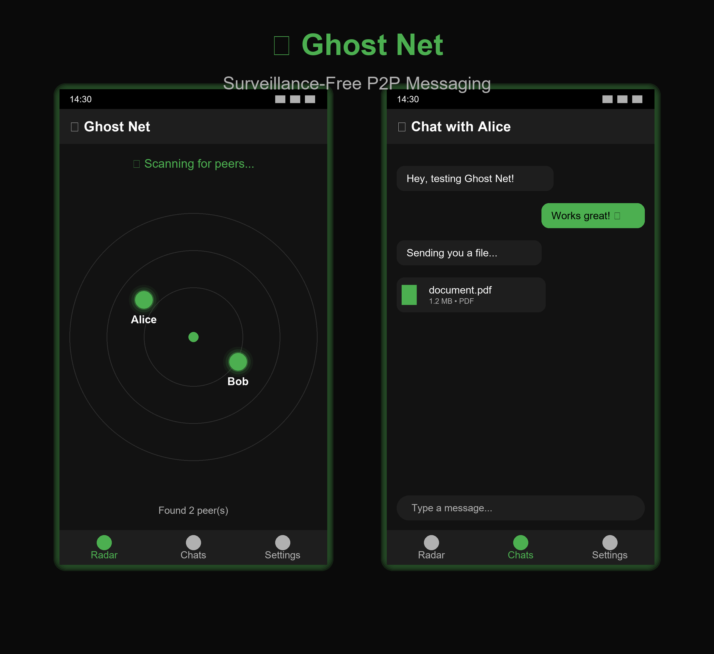
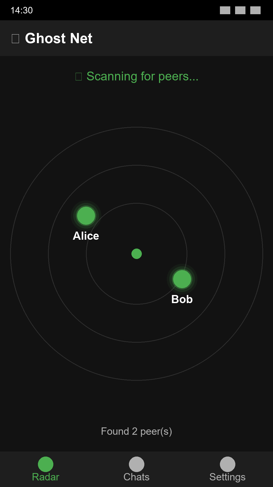
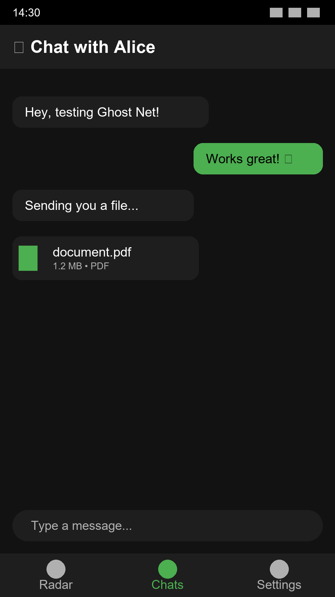
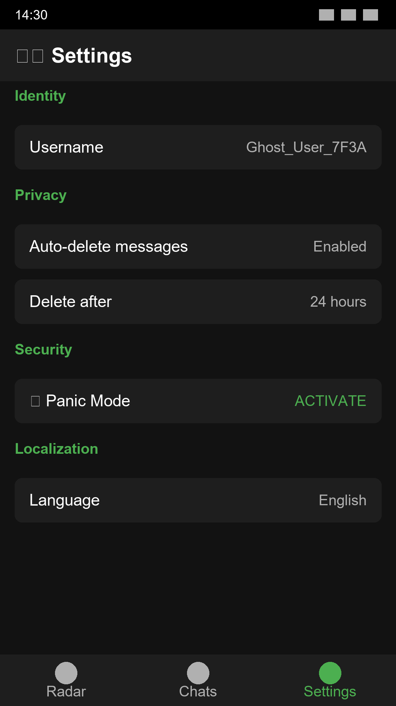

# 👻 Ghost Net

<div align="center">



**Surveillance-Free P2P Messaging for the Privacy-Conscious**

[](https://www.python.org/)
[](https://kivy.org/)
[](LICENSE)
[](CONTRIBUTING.md)

[📥 Download APK](#-installation) • [📖 Documentation](#-documentation) • [🌐 Website](web/index.html) • [🤝 Contribute](#-contributing)

</div>

---

## 🚨 The Problem

> **"If you're not paying for the product, you ARE the product."**

Every day, billions of people trust their private conversations to:
- 📡 **Centralized servers** that log everything
- 🕵️ **Data brokers** who sell your metadata
- 👁️ **Governments** with backdoor access
- 💰 **Corporations** monetizing your relationships

**Even "encrypted" apps leak:**
- Who you talk to (metadata)
- When you talk (timing analysis)
- Where you are (IP addresses)
- What devices you use (fingerprinting)

---

## 💡 The Solution: Ghost Net

**What if your messages never touched a server?**

Ghost Net is a **zero-server, peer-to-peer messaging app** that runs entirely over your local Wi-Fi network. No internet required. No servers to compromise. No metadata to leak.

### 🎯 Core Philosophy

```
┌─────────────────────────────────────────┐
│  Traditional Apps      │   Ghost Net    │
├────────────────────────┼────────────────┤
│  Your Phone            │   Your Phone   │
│       ↓                │       ↕        │
│  Company Servers  ❌   │   Friend's     │
│       ↓                │   Phone ✅     │
│  Friend's Phone        │                │
└─────────────────────────────────────────┘
```

**No middleman. No surveillance. Just you and your peers.**

---

## ✨ Features

<table>
<tr>
<td width="50%" valign="top">

### 🔍 **Auto-Discovery Radar**



Instantly finds nearby peers on your Wi-Fi network using UDP broadcasts. No usernames, no passwords, no accounts.

</td>
<td width="50%" valign="top">

### 💬 **Encrypted Messaging**



End-to-end encrypted chat with file transfers. Messages never leave your local network.

</td>
</tr>
<tr>
<td width="50%" valign="top">

### ⚙️ **Privacy Controls**



Auto-delete messages, Panic Mode to wipe data instantly, multi-language support, and more.

</td>
<td width="50%" valign="top">

### 🛡️ **Security by Design**

- 🔐 **AES-128 Encryption** (Fernet)
- 🔑 **Daily Key Rotation**
- 🧹 **Auto-Delete Messages**
- 🚨 **Panic Mode** (instant wipe)
- 🌍 **4 Languages** (EN, ES, HI, ZH)
- 📱 **Mobile-First Design**

</td>
</tr>
</table>

---

## 🎬 How It Works

### 3-Step Setup (< 30 seconds)


1. **📶 Connect** - Both devices join the same Wi-Fi network (or create a hotspot)
2. **👻 Launch** - Open Ghost Net app on both devices
3. **💬 Chat** - Peers auto-discover in 2-4 seconds. Start messaging!

### Real-World Use Cases

| Scenario | Why Ghost Net? |
|----------|----------------|
| 🏢 **Workplace** | Discuss sensitive topics without corporate monitoring |
| ✈️ **Travel** | Communicate in countries with internet censorship |
| 🏡 **Home** | Family chat without feeding data to Big Tech |
| 🎓 **Campus** | Student organizing without admin oversight |
| 🏕️ **Outdoors** | Mesh communication in areas without cell service |
| 🔒 **Journalism** | Source protection via airgapped communication |

---

## 🚀 Installation

### Option 1: Android APK (Recommended)

```bash
# Download the latest release
wget https://github.com/yourusername/Ghost_Net/releases/latest/download/GhostNet_v1.0.0.apk

# Install via ADB
adb install GhostNet_v1.0.0.apk

# Or transfer to phone and install manually
```

### Option 2: Build from Source

**Desktop (Development):**
```bash
git clone https://github.com/yourusername/Ghost_Net.git
cd Ghost_Net
pip install -r requirements.txt
python main.py
```

**Android (Production):**
```bash
# Linux/macOS only (or WSL on Windows)
pip install buildozer
buildozer -v android debug

# APK output: bin/ghostnet-1.0.0-arm64-v8a-debug.apk
```

📖 **Full build guide:** [`DEPLOYMENT.md`](DEPLOYMENT.md)

---

## 🔐 Security Architecture

### Encryption Stack

```
┌─────────────────────────────────────────────┐
│           Application Layer                 │
│  • User messages & files                    │
└─────────────────┬───────────────────────────┘
                  ↓
┌─────────────────────────────────────────────┐
│         Encryption Layer                    │
│  • Fernet (AES-128 + HMAC-SHA256)          │
│  • Daily rotating keys                      │
│  • Authenticated encryption                 │
└─────────────────┬───────────────────────────┘
                  ↓
┌─────────────────────────────────────────────┐
│          Network Layer                      │
│  • TCP for messages (Port 37021)           │
│  • UDP for discovery (Port 37020)          │
│  • Local network only (no internet)        │
└─────────────────────────────────────────────┘
```

### What's Protected

✅ **Message Content** - AES-128 symmetric encryption  
✅ **Message Integrity** - HMAC-SHA256 authentication  
✅ **Local Network** - No internet exposure  
✅ **Auto-Cleanup** - Messages auto-delete after 24h (configurable)  
✅ **Panic Mode** - Instant database wipe on emergency  

### Current Limitations

⚠️ **Shared Secret** - All peers on network use same daily key (date-based)  
⚠️ **No User Auth** - Username spoofing possible  
⚠️ **No Forward Secrecy** - Key compromise decrypts old messages  

📋 **Roadmap:** Diffie-Hellman key exchange, device fingerprinting, and per-peer session keys coming in v2.0

---

## 📖 Documentation

Comprehensive guides for every use case:

| Document | Description |
|----------|-------------|
| [`ARCHITECTURE_REVIEW.md`](ARCHITECTURE_REVIEW.md) | Deep-dive technical analysis |
| [`FILE_TRANSFER_DOCS.md`](FILE_TRANSFER_DOCS.md) | File sharing protocol & implementation |
| [`STORAGE_DOCS.md`](STORAGE_DOCS.md) | Encrypted SQLite database schema |
| [`SETTINGS_DOCS.md`](SETTINGS_DOCS.md) | Configuration & privacy controls |
| [`LOCALIZATION_GUIDE.md`](LOCALIZATION_GUIDE.md) | Multi-language integration guide |
| [`DEPLOYMENT.md`](DEPLOYMENT.md) | Build & deployment instructions |
| [`RELEASE_NOTES.md`](RELEASE_NOTES.md) | Version history & changelog |

---

## 🛠️ Technology Stack

<div align="center">

| Layer | Technology | Purpose |
|-------|-----------|---------|
| **UI** | [KivyMD](https://github.com/kivymd/KivyMD) | Material Design interface |
| **Framework** | [Kivy](https://kivy.org/) | Cross-platform Python framework |
| **Encryption** | [Cryptography](https://cryptography.io/) | Fernet symmetric encryption |
| **Storage** | [SQLite](https://www.sqlite.org/) | Encrypted message persistence |
| **Network** | Python `socket` | UDP discovery + TCP messaging |
| **Build** | [Buildozer](https://github.com/kivy/buildozer) | Android APK packaging |

</div>

---

## 🧪 Testing

### Automated Test Suite

```bash
# Run full test suite
python test_network.py

# Test in two terminals (simulates 2 peers)
python test_network.py Alice
python test_network.py Bob  # In another terminal
```

**Test Coverage:**
- ✅ Engine initialization & thread spawning
- ✅ Encryption/decryption with daily key rotation
- ✅ UDP peer discovery & timeout handling
- ✅ TCP message delivery
- ✅ File transfer protocol
- ✅ Database persistence & cleanup
- ✅ Clean shutdown

### Manual Testing Checklist

- [ ] **Discovery Test** - Both devices find each other within 5 seconds
- [ ] **Message Test** - Send 10 messages in both directions
- [ ] **File Test** - Send images, PDFs, videos
- [ ] **Network Disruption** - Disable Wi-Fi, re-enable, verify reconnection
- [ ] **Panic Mode** - Activate and verify database wipe
- [ ] **Auto-Delete** - Wait 24h, verify messages removed
- [ ] **Multi-Language** - Switch languages, verify UI updates

---

## 📊 Performance Metrics

### Network Efficiency

| Metric | Value | Notes |
|--------|-------|-------|
| **Idle Bandwidth** | ~50 bytes/2s | UDP beacons per peer |
| **Message Size** | 100-500 bytes | Encrypted payload |
| **Total Usage** | < 1 KB/s | 10 peers, moderate messaging |
| **Discovery Time** | 2-4 seconds | Typical on local Wi-Fi |
| **Peer Timeout** | 10 seconds | Inactivity threshold |

### Resource Usage

| Resource | Usage | Impact |
|----------|-------|--------|
| **RAM** | 50-80 MB | Base app footprint |
| **Battery** | < 5% per hour | Estimated drain |
| **Storage** | ~500 KB | App binary + database |
| **CPU** | Minimal | Encryption < 1ms per message |

---

## 🎨 Customization

### Themes & Colors

Edit [`main.py`](main.py:286):

```python
self.theme_cls.theme_style = "Dark"  # "Light" or "Dark"
self.theme_cls.primary_palette = "Green"  # Any Material color
```

### Network Ports

Edit [`network.py`](network.py:15):

```python
UDP_PORT = 37020  # Discovery broadcasts
TCP_PORT = 37021  # Message transfer
```

### Auto-Delete Timing

Edit [`config.py`](config.py:12) or change in Settings screen:

```python
'cleanup_hours': 24  # Hours before auto-delete
```

### Add New Languages

See [`LOCALIZATION_GUIDE.md`](LOCALIZATION_GUIDE.md) for step-by-step instructions.

---

## 🐛 Troubleshooting

<details>
<summary><b>❌ Peers Not Found</b></summary>

**Symptoms:** Radar shows "No peers found" after 10+ seconds

**Solutions:**
1. ✅ Verify both devices on **same Wi-Fi network**
2. ✅ Check router allows UDP multicast (some routers block it)
3. ✅ Try mobile hotspot instead of router
4. ✅ Disable VPN on both devices
5. ✅ Check firewall allows UDP port 37020
6. ✅ Grant network permissions: Settings → Apps → Ghost Net → Permissions

</details>

<details>
<summary><b>❌ Messages Not Sending</b></summary>

**Symptoms:** Send button works but messages don't arrive

**Solutions:**
1. ✅ Verify peer still in peer list (may have timed out)
2. ✅ Check firewall allows TCP port 37021
3. ✅ Restart both apps to resync encryption keys
4. ✅ Check `adb logcat` for error details (Android)

</details>

<details>
<summary><b>❌ Encryption Errors</b></summary>

**Symptoms:** Console shows "Decryption failed"

**Solutions:**
1. ✅ Ensure both devices have **synchronized system time**
2. ✅ Update both apps to same version
3. ✅ Restart apps to regenerate daily key

</details>

<details>
<summary><b>❌ High Battery Drain</b></summary>

**Solutions:**
1. ✅ Increase beacon interval in [`network.py`](network.py:16): `BEACON_INTERVAL = 5`
2. ✅ Enable Android battery optimization for Ghost Net
3. ✅ Close app when not in use (no background service yet)

</details>

📖 **More help:** Open an issue on GitHub or check [existing issues](https://github.com/yourusername/Ghost_Net/issues)

---

## 🗺️ Roadmap

### v1.0.0 (Current) ✅
- [x] P2P messaging over local Wi-Fi
- [x] End-to-end encryption (Fernet)
- [x] File transfers (images, documents)
- [x] Encrypted message persistence
- [x] Auto-delete messages
- [x] Panic Mode (instant wipe)
- [x] Multi-language support (4 languages)
- [x] Material Design UI

### v1.1.0 (Next Release) 🚧
- [ ] Diffie-Hellman key exchange (per-peer keys)
- [ ] Device fingerprinting (anti-spoofing)
- [ ] Group chats (multi-peer broadcast)
- [ ] Voice messages (audio recording)
- [ ] Dark theme customization
- [ ] Background service (persistent discovery)

### v2.0.0 (Future) 🔮
- [ ] Bluetooth mesh networking (no Wi-Fi required)
- [ ] Desktop apps (Windows, macOS, Linux)
- [ ] QR code peer verification
- [ ] Disappearing messages (Signal-style)
- [ ] Screen security (block screenshots)
- [ ] iOS version (React Native port?)

**🗳️ Vote on features:** [GitHub Discussions](https://github.com/yourusername/Ghost_Net/discussions)

---

## 🤝 Contributing

Ghost Net is **100% open-source** and welcomes contributions!

### How to Contribute

1. **🐛 Report Bugs** - Open an issue with reproduction steps
2. **💡 Suggest Features** - Propose enhancements via discussions
3. **🔧 Submit PRs** - Fork, code, test, and submit pull requests
4. **📖 Improve Docs** - Fix typos, add examples, clarify instructions
5. **🌍 Translate** - Add new languages to [`assets/locales/`](assets/locales/)
6. **⭐ Star the Repo** - Help others discover Ghost Net!

### Development Setup

```bash
# Clone and setup
git clone https://github.com/yourusername/Ghost_Net.git
cd Ghost_Net
python -m venv venv
source venv/bin/activate  # or `venv\Scripts\activate` on Windows
pip install -r requirements.txt

# Run tests
python test_network.py

# Start development server
python main.py
```

### Code Standards

- ✅ Follow PEP 8 style guide
- ✅ Add type hints for new functions
- ✅ Write docstrings for public methods
- ✅ Test on both desktop and Android
- ✅ Update relevant documentation

📖 **Full guidelines:** [`CONTRIBUTING.md`](CONTRIBUTING.md)

---

## 📜 License

Ghost Net is released under the **MIT License**.

```
Copyright (c) 2026 Ghost Net Contributors

Permission is hereby granted, free of charge, to any person obtaining a copy
of this software and associated documentation files (the "Software"), to deal
in the Software without restriction, including without limitation the rights
to use, copy, modify, merge, publish, distribute, sublicense, and/or sell
copies of the Software, and to permit persons to whom the Software is
furnished to do so, subject to the following conditions:

[Full MIT License text...]
```

**TL;DR:** Use, modify, and distribute freely. See [`LICENSE`](LICENSE) for details.

---

## 🌟 Star History

[](https://star-history.com/#yourusername/Ghost_Net&Date)

---

## 🙏 Acknowledgments

Built with these incredible open-source projects:

- **[Kivy](https://kivy.org/)** - Cross-platform Python framework
- **[KivyMD](https://github.com/kivymd/KivyMD)** - Material Design components
- **[Cryptography.io](https://cryptography.io/)** - Modern encryption library
- **[Buildozer](https://github.com/kivy/buildozer)** - Android packaging tool

Special thanks to:
- 💚 **Early testers** who stress-tested the network engine
- 🌍 **Translators** who made Ghost Net multilingual
- 🔐 **Security researchers** who reviewed the encryption design
- ❤️ **Open-source community** for inspiration and support

---

## 📞 Contact & Support

<div align="center">

### Need Help?

[](https://github.com/yourusername/Ghost_Net/issues)
[](https://github.com/yourusername/Ghost_Net/discussions)

### Stay Connected

[](https://twitter.com/ghostnet_app)
[](https://reddit.com/r/GhostNetApp)
[](https://discord.gg/ghostnet)

</div>

---

<div align="center">

## 🎯 Why Ghost Net Exists

> **"Privacy is not about having something to hide. Privacy is about having something to protect."**

In an era of mass surveillance, Ghost Net is a statement:

**Your conversations belong to YOU, not corporations or governments.**

---

### 🚀 Ready to Go Ghost?

[](https://github.com/yourusername/Ghost_Net/releases/latest)
[](DEPLOYMENT.md)
[](ARCHITECTURE_REVIEW.md)

---

**Built with ❤️ by privacy advocates, for privacy advocates**

*Ghost Net v1.0.0 - Message freely, locally, securely* 👻

⭐ **Star this repo if you believe in surveillance-free communication!** ⭐

</div>
