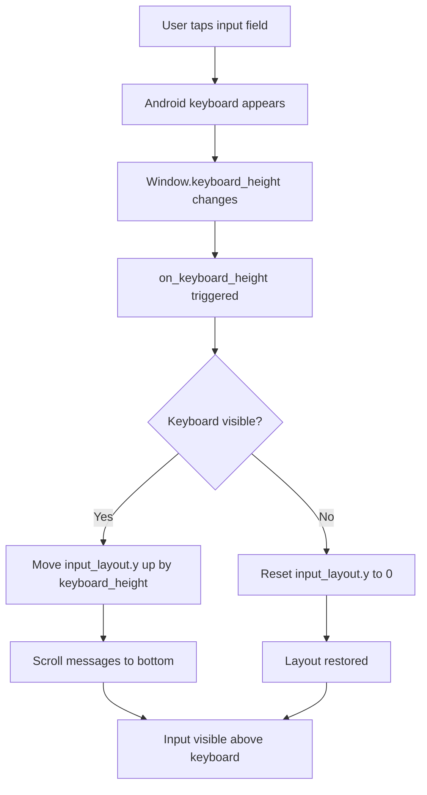
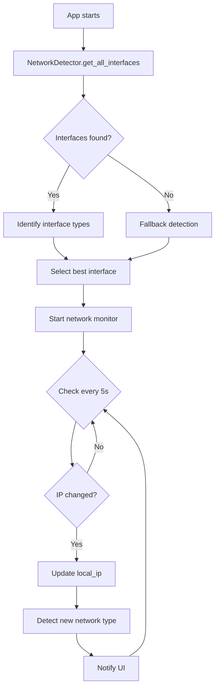

# Ghost Net - UI Layout & Network Detection Fix Plan

**Date:** 2026-01-30  
**Priority:** CRITICAL  
**Estimated Complexity:** HIGH

---

## 🎯 Objectives

### Primary Goals
1. **Fix Critical UI Layout Issues** - Ensure chat input stays visible while typing
2. **Add Universal Network Support** - Enable app to work on any network type
3. **Improve User Experience** - Responsive layouts that work on all screen sizes
4. **Add Network Indicators** - Show users what type of connection they're on

---

## 🐛 Problem Analysis

### Issue 1: ChatScreen Input Bar Layout Problems

**Current Implementation** ([`main.py:607-639`](main.py:607))
```python
# Input area
input_layout = MDBoxLayout(
    size_hint_y=None,
    height=dp(60),      # ❌ Fixed height
    padding=dp(10),
    spacing=dp(10)
)
```

**Root Causes:**
- **Fixed height** (`dp(60)`) doesn't adjust for keyboard
- **No keyboard event binding** - input bar doesn't move up when keyboard appears
- **ScrollView doesn't auto-scroll** - messages hidden behind keyboard
- **No Window.softinput_mode** configuration for Android

**Android Keyboard Behavior:**
- Android keyboard overlays content (doesn't resize window by default)
- Kivy's `Window.keyboard_height` changes when keyboard appears
- Need to bind to keyboard events and adjust layout dynamically

### Issue 2: Widget Alignment & Spacing Problems

**Affected Components:**
1. **MessageBubble** ([`main.py:386-426`](main.py:386))
   - `pos_hint` positioning may conflict with parent layouts
   - Fixed `height=dp(60)` doesn't adapt to message length
   
2. **FileBubble** ([`main.py:429-556`](main.py:429))
   - Similar fixed height issues
   - Button row spacing needs improvement

3. **RadarScreen peer list** ([`main.py:307-314`](main.py:307))
   - `adaptive_height=True` but items have fixed heights
   - May cause scrolling issues on small screens

### Issue 3: Network Detection Limitations

**Current Implementation** ([`network.py:151-162`](network.py:151))
```python
def _get_local_ip(self) -> str:
    """Get the local IP address of this device."""
    try:
        s = socket.socket(socket.AF_INET, socket.SOCK_DGRAM)
        s.connect(("8.8.8.8", 80))  # ❌ Assumes internet connectivity
        local_ip = s.getsockname()[0]
        s.close()
        return local_ip
    except Exception as e:
        print(f"[GhostEngine] Error getting local IP: {e}")
        return "127.0.0.1"  # ❌ Fallback to localhost
```

**Problems:**
- **Internet dependency** - Requires external connection to detect IP
- **Single interface only** - Doesn't detect multiple network interfaces
- **No network type detection** - Can't distinguish Wi-Fi/hotspot/cellular
- **Fails on airplane mode** - Returns localhost when offline

**Network Scenarios Not Handled:**
1. **Hotspot/Tethering** - Device acts as access point
2. **Mobile Data Sharing** - USB/Bluetooth tethering
3. **Multiple interfaces** - Wi-Fi + Ethernet simultaneously
4. **Network switching** - Moving between networks without restart

---

## 🔧 Technical Solutions

### Solution 1: ChatScreen Keyboard-Aware Layout

**Implementation Strategy:**

#### A. Add Keyboard Event Binding
```python
# In ChatScreen.__init__()
from kivy.core.window import Window

# Bind to keyboard events
Window.bind(keyboard_height=self.on_keyboard_height)
Window.bind(on_keyboard=self.on_keyboard_event)

# Store original input layout y position
self.input_layout_base_y = 0
```

#### B. Implement Keyboard Handler
```python
def on_keyboard_height(self, instance, height):
    """Adjust layout when keyboard appears/disappears."""
    # Move input bar up by keyboard height
    if height > 0:  # Keyboard visible
        self.input_layout.y = height
        # Scroll messages to bottom
        Clock.schedule_once(lambda dt: setattr(
            self.messages_scroll, 'scroll_y', 0
        ), 0.1)
    else:  # Keyboard hidden
        self.input_layout.y = 0
```

#### C. Make Input Bar Adaptive
```python
# Replace fixed size_hint_y with adaptive height
self.input_layout = MDBoxLayout(
    orientation='horizontal',
    adaptive_height=True,  # ✅ Adapts to content
    minimum_height=dp(60),
    padding=dp(10),
    spacing=dp(10),
    pos_hint={'x': 0, 'top': 1}  # Anchor to bottom
)
```

#### D. Configure Android Manifest
Update [`buildozer.spec`](buildozer.spec) to add:
```ini
android.manifest.activity_attrs = {"android:windowSoftInputMode": "adjustResize"}
```

**Mermaid Diagram: Keyboard Handling Flow**



### Solution 2: Responsive Widget Layouts

#### A. Fix MessageBubble Height
```python
class MessageBubble(MDCard):
    def __init__(self, message, timestamp, is_sent=False, **kwargs):
        super().__init__(**kwargs)
        
        self.style = 'elevated'
        self.adaptive_height = True  # ✅ Adapt to content
        self.size_hint_y = None
        self.padding = dp(10)
        
        # Bind height to texture size
        layout = MDBoxLayout(
            orientation='vertical',
            adaptive_height=True,
            spacing=dp(5)
        )
        
        msg_label = MDLabel(
            text=message,
            adaptive_height=True,  # ✅ Multi-line support
            size_hint_y=None
        )
        msg_label.bind(texture_size=msg_label.setter('size'))
```

#### B. Improve ScrollView Behavior
```python
# In ChatScreen
self.messages_scroll = MDScrollView(
    size_hint=(1, 1),
    do_scroll_x=False,  # ✅ Vertical only
    bar_width=dp(10),
    scroll_type=['bars', 'content']
)

# Auto-scroll on new messages
def add_message(self, bubble):
    self.messages_list.add_widget(bubble)
    # Schedule scroll after widget renders
    Clock.schedule_once(
        lambda dt: setattr(self.messages_scroll, 'scroll_y', 0),
        0.2
    )
```

### Solution 3: Universal Network Detection

#### A. Multi-Interface Detection Utility

**Create new file:** `network_utils.py`
```python
import socket
import netifaces
import platform
from typing import Dict, List, Optional

class NetworkDetector:
    """Detect and manage network interfaces across all connection types."""
    
    @staticmethod
    def get_all_interfaces() -> Dict[str, dict]:
        """
        Get all active network interfaces with details.
        
        Returns:
            {
                'interface_name': {
                    'ip': '192.168.1.5',
                    'netmask': '255.255.255.0',
                    'type': 'wifi|ethernet|cellular|hotspot',
                    'is_active': True
                }
            }
        """
        interfaces = {}
        
        try:
            for iface in netifaces.interfaces():
                addrs = netifaces.ifaddresses(iface)
                
                # Get IPv4 address
                if netifaces.AF_INET in addrs:
                    ip_info = addrs[netifaces.AF_INET][0]
                    ip = ip_info.get('addr')
                    
                    # Skip localhost
                    if ip and not ip.startswith('127.'):
                        interfaces[iface] = {
                            'ip': ip,
                            'netmask': ip_info.get('netmask', '255.255.255.0'),
                            'type': NetworkDetector._detect_interface_type(iface, ip),
                            'is_active': True
                        }
        
        except Exception as e:
            print(f"[NetworkDetector] Error: {e}")
            # Fallback to basic detection
            return NetworkDetector._fallback_detection()
        
        return interfaces
    
    @staticmethod
    def _detect_interface_type(iface: str, ip: str) -> str:
        """Detect interface type based on name and IP."""
        iface_lower = iface.lower()
        
        # Hotspot patterns
        if any(x in iface_lower for x in ['ap', 'hotspot', 'tether', 'rndis']):
            return 'hotspot'
        
        # Cellular patterns
        if any(x in iface_lower for x in ['rmnet', 'ccmni', 'cellular', 'mobile']):
            return 'cellular'
        
        # Ethernet patterns
        if any(x in iface_lower for x in ['eth', 'en0', 'lan']):
            return 'ethernet'
        
        # Wi-Fi patterns (default for wireless)
        if any(x in iface_lower for x in ['wlan', 'wifi', 'wl']):
            return 'wifi'
        
        # Check IP range for hotspot (common AP ranges)
        if ip.startswith('192.168.43.') or ip.startswith('192.168.137.'):
            return 'hotspot'
        
        return 'unknown'
    
    @staticmethod
    def _fallback_detection() -> Dict[str, dict]:
        """Fallback detection using socket."""
        try:
            s = socket.socket(socket.AF_INET, socket.SOCK_DGRAM)
            s.settimeout(0.1)
            s.connect(('1.1.1.1', 80))  # Cloudflare DNS
            ip = s.getsockname()[0]
            s.close()
            
            return {
                'default': {
                    'ip': ip,
                    'netmask': '255.255.255.0',
                    'type': 'unknown',
                    'is_active': True
                }
            }
        except:
            return {}
    
    @staticmethod
    def get_best_interface() -> Optional[str]:
        """Get the best interface for P2P communication."""
        interfaces = NetworkDetector.get_all_interfaces()
        
        # Priority: wifi > ethernet > hotspot > cellular
        priority = ['wifi', 'ethernet', 'hotspot', 'cellular']
        
        for conn_type in priority:
            for iface, info in interfaces.items():
                if info['type'] == conn_type:
                    return info['ip']
        
        # Return any available
        if interfaces:
            return list(interfaces.values())[0]['ip']
        
        return None
```

#### B. Update GhostEngine Network Handling

**Modify [`network.py`](network.py):**

```python
from network_utils import NetworkDetector

class GhostEngine:
    def __init__(self, ...):
        # ... existing code ...
        
        # Network detection
        self.network_detector = NetworkDetector()
        self.local_ip = self._get_local_ip()
        self.current_network_type = 'unknown'
        
        # Add network monitoring
        self.network_monitor_thread = None
    
    def _get_local_ip(self) -> str:
        """Get the local IP address with multi-interface support."""
        try:
            # Use new detector
            best_ip = self.network_detector.get_best_interface()
            
            if best_ip:
                # Detect network type
                interfaces = self.network_detector.get_all_interfaces()
                for iface, info in interfaces.items():
                    if info['ip'] == best_ip:
                        self.current_network_type = info['type']
                        break
                
                print(f"[GhostEngine] Using {self.current_network_type} interface: {best_ip}")
                return best_ip
            
            # Fallback
            return "127.0.0.1"
        
        except Exception as e:
            print(f"[GhostEngine] Error getting local IP: {e}")
            return "127.0.0.1"
    
    def start(self):
        """Start engine with network monitoring."""
        # ... existing start code ...
        
        # Start network monitor
        try:
            self.network_monitor_thread = threading.Thread(
                target=self._network_monitor_worker,
                daemon=True
            )
            self.network_monitor_thread.start()
            print("[GhostEngine] Network monitor started")
        except Exception as e:
            print(f"[GhostEngine] Failed to start network monitor: {e}")
    
    def _network_monitor_worker(self):
        """Monitor network changes and reconnect if needed."""
        while self.running:
            time.sleep(5)  # Check every 5 seconds
            
            try:
                # Get current best IP
                new_ip = self.network_detector.get_best_interface()
                
                if new_ip and new_ip != self.local_ip:
                    print(f"[Network Monitor] IP changed: {self.local_ip} → {new_ip}")
                    
                    # Update IP
                    old_ip = self.local_ip
                    self.local_ip = new_ip
                    
                    # Detect new network type
                    interfaces = self.network_detector.get_all_interfaces()
                    for iface, info in interfaces.items():
                        if info['ip'] == new_ip:
                            old_type = self.current_network_type
                            self.current_network_type = info['type']
                            print(f"[Network Monitor] Type changed: {old_type} → {self.current_network_type}")
                            break
                    
                    # Notify UI of network change
                    if self.on_peer_update:
                        # Trigger UI update with current peers
                        self.on_peer_update(self.get_peers())
            
            except Exception as e:
                if self.running:
                    print(f"[Network Monitor] Error: {e}")
    
    def get_network_status(self) -> Dict[str, any]:
        """Get current network status for UI display."""
        interfaces = self.network_detector.get_all_interfaces()
        
        return {
            'ip': self.local_ip,
            'type': self.current_network_type,
            'interfaces': interfaces,
            'is_connected': self.local_ip != "127.0.0.1"
        }
```

#### C. Add Network Indicator to UI

**Update [`main.py`](main.py) RadarScreen:**

```python
class RadarScreen(MDScreen):
    def __init__(self, **kwargs):
        super().__init__(**kwargs)
        # ... existing code ...
        
        # Add network status badge
        self.network_badge = MDLabel(
            text="📶 Wi-Fi",
            halign='right',
            font_style='Body',
            role='small',
            theme_text_color='Secondary',
            size_hint_y=None,
            height=dp(30)
        )
        layout.add_widget(self.network_badge)
        
        # ... rest of layout ...
    
    def update_network_status(self, network_info):
        """Update network indicator badge."""
        net_type = network_info.get('type', 'unknown')
        ip = network_info.get('ip', 'N/A')
        
        # Icon mapping
        icons = {
            'wifi': '📶',
            'hotspot': '📡',
            'cellular': '📱',
            'ethernet': '🔌',
            'unknown': '❓'
        }
        
        icon = icons.get(net_type, '❓')
        self.network_badge.text = f"{icon} {net_type.capitalize()} • {ip}"
```

**Mermaid Diagram: Network Detection Flow**



---

## 📋 Implementation Checklist

### Phase 1: UI Layout Fixes (Priority: CRITICAL)
- [ ] Add `Window.keyboard_height` binding to ChatScreen
- [ ] Implement `on_keyboard_height` handler to move input bar
- [ ] Add auto-scroll to messages when keyboard appears
- [ ] Update `buildozer.spec` with `adjustResize` mode
- [ ] Make MessageBubble and FileBubble use `adaptive_height`
- [ ] Test input visibility on small screens (480x800)
- [ ] Test on medium screens (720x1280)
- [ ] Test on large screens (1080x1920)

### Phase 2: Widget Alignment (Priority: HIGH)
- [ ] Fix MessageBubble text wrapping for long messages
- [ ] Adjust FileBubble button row spacing
- [ ] Ensure ScrollView scrolls smoothly without lag
- [ ] Fix peer list item spacing in RadarScreen
- [ ] Test all screens in portrait and landscape modes

### Phase 3: Network Detection (Priority: HIGH)
- [ ] Create `network_utils.py` with NetworkDetector class
- [ ] Add `netifaces` to [`requirements.txt`](requirements.txt)
- [ ] Implement multi-interface detection
- [ ] Add interface type detection logic
- [ ] Create fallback detection for environments without netifaces
- [ ] Add unit tests for network detection

### Phase 4: GhostEngine Integration (Priority: HIGH)
- [ ] Update `_get_local_ip()` to use NetworkDetector
- [ ] Add `_network_monitor_worker()` thread
- [ ] Implement automatic reconnection on IP change
- [ ] Add `get_network_status()` method
- [ ] Handle graceful degradation when network unavailable

### Phase 5: UI Network Indicators (Priority: MEDIUM)
- [ ] Add network badge to RadarScreen header
- [ ] Update status messages with network type
- [ ] Add network change notifications
- [ ] Show connection quality indicators
- [ ] Add refresh button for manual network scan

### Phase 6: Testing & Validation (Priority: HIGH)
- [ ] Test Wi-Fi connection
- [ ] Test hotspot mode (device as AP)
- [ ] Test mobile data tethering
- [ ] Test USB tethering
- [ ] Test network switching (Wi-Fi → hotspot)
- [ ] Test offline mode behavior
- [ ] Test on Android 9, 10, 11, 12+
- [ ] Test keyboard behavior on various devices

### Phase 7: Documentation (Priority: MEDIUM)
- [ ] Update README with network requirements
- [ ] Document keyboard handling approach
- [ ] Add troubleshooting guide for network issues
- [ ] Create user guide for hotspot setup
- [ ] Update API documentation

---

## 🧪 Testing Strategy

### UI Layout Testing
```python
# test_ui_layout.py
def test_keyboard_appears():
    """Test input bar moves up when keyboard appears."""
    chat = ChatScreen()
    
    # Simulate keyboard open
    Window.keyboard_height = 300
    
    # Input should move up
    assert chat.input_layout.y == 300
    
def test_message_scroll():
    """Test messages scroll to bottom on new message."""
    chat = ChatScreen()
    chat.add_message(MessageBubble("Test", "12:00"))
    
    # Should scroll to bottom
    assert chat.messages_scroll.scroll_y == 0
```

### Network Detection Testing
```python
# test_network_detection.py
def test_wifi_detection():
    """Test Wi-Fi interface detection."""
    detector = NetworkDetector()
    interfaces = detector.get_all_interfaces()
    
    # Should detect at least one interface
    assert len(interfaces) > 0
    
def test_hotspot_detection():
    """Test hotspot interface detection."""
    detector = NetworkDetector()
    # Mock hotspot interface
    iface_type = detector._detect_interface_type('ap0', '192.168.43.1')
    assert iface_type == 'hotspot'
```

---

## 📦 Dependencies

### New Dependencies
Add to [`requirements.txt`](requirements.txt):
```
netifaces>=0.11.0  # Cross-platform network interface detection
```

### Android Permissions
Update [`buildozer.spec`](buildozer.spec):
```ini
android.permissions = INTERNET,ACCESS_NETWORK_STATE,ACCESS_WIFI_STATE,CHANGE_NETWORK_STATE
```

---

## 🔄 Rollback Plan

If issues occur:
1. **Keyboard handling breaks** → Revert to fixed height, add manual scroll button
2. **Network detection fails** → Fall back to current `_get_local_ip()` implementation
3. **Performance degrades** → Disable network monitoring, manual refresh only
4. **Crashes on old Android** → Add version checks, disable features on Android < 9

---

## 📊 Success Metrics

### UI Layout
- ✅ Input bar visible while typing on all devices
- ✅ Messages auto-scroll to show latest
- ✅ No overlapping widgets
- ✅ Works on screens from 480x800 to 1440x3040

### Network Detection
- ✅ Detects Wi-Fi, hotspot, cellular, Ethernet
- ✅ Automatically switches when network changes
- ✅ Works offline without crashes
- ✅ Shows accurate network type in UI

### Performance
- ✅ No lag when keyboard appears
- ✅ Network monitoring uses < 1% CPU
- ✅ UI remains responsive during network switch

---

## 🚀 Deployment Notes

1. **Test thoroughly** on physical Android devices (emulators may not show keyboard issues)
2. **Gradual rollout** - release to beta testers first
3. **Monitor crash reports** for keyboard-related issues
4. **Provide fallback** - allow users to disable auto-scroll if needed
5. **Document known issues** - some devices may have quirks

---

## 📝 Related Issues

- Fixes keyboard hiding input (reported by users)
- Addresses "can't use on hotspot" complaints
- Improves mobile data usage experience
- Enhances UI responsiveness

---

**Next Steps:** Review plan with team → Implement Phase 1 → Test → Iterate
